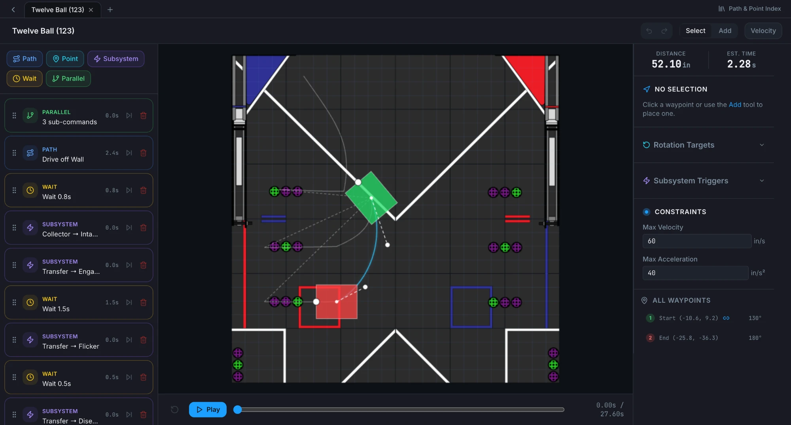

<p align="center">
  
</p>

<h1 align="center">BrainSTEM Pilot</h1>

<p align="center">
  <a href="https://brainstem-first.github.io/Brainstem-Pilot-UI/"><b>Live app</b></a>
  ·
  <a href="https://github.com/BrainStem-FIRST/Brainstem-Pilot-UI/releases/latest"><b>Download for desktop</b></a>
  ·
  <a href="#why-brainstem-pilot"><b>Why BrainSTEM Pilot</b></a>
</p>

A trajectory planner for FRC/FTC robots that lets you visually build smooth Bezier paths, set holonomic rotation targets, and place mid-path subsystem action markers. It automatically exports clean path and auto json files ready for your robot code. Runs in the browser or as a desktop app for macOS, Windows, and Linux.



## Why BrainSTEM Pilot?

**A high barrier to entry.** Autonomous pathing in FTC and FRC usually means climbing a steep learning curve — trajectory math, custom kinematics, and a rigid local toolchain to set up — before the robot moves at all.

**No real-time visualization.** Without watching a trajectory play out, acceleration violations, waypoint drift, and edge cases stay invisible until the code is on physical hardware, which is the slowest and most expensive place to find them.

BrainSTEM Pilot puts the whole loop in one visual editor: draw the path, see the robot's footprint sweep it, and read the time estimate before anything is deployed.

**Low floor, high ceiling.** A rookie team can open the app and have a working auto on the field the same afternoon, without writing a line of trajectory math. Nothing about that gets in the way of a team chasing a top score — per-waypoint velocity and acceleration limits, decoupled holonomic rotation targets, mid-path subsystem triggers, parallel command groups, and one-click mirroring across both the field midline and the alliance line are all there when a routine needs to be squeezed for tenths.

### How it compares

| Feature | ⭐ **BrainSTEM Pilot** | Choreo | PathPlanner | Pedro Pathing | Road Runner |
| --- | :---: | :---: | :---: | :---: | :---: |
| Cross-system (FTC & FRC) | ✅ | ❌ | ❌ | ❌ | ❌ |
| Bézier curve drive trajectories | ✅ | ❌ | ✅ | ✅ | ❌ |
| Execution time estimates | ✅ | ✅ | ✅ | ✅ | ✅ |
| Editor-side mirroring (1 path → 4 paths) | ✅ | ❌ | ❌ | ❌ | ❌ |
| Footprint that changes with mechanism state | ✅ | ❌ | ❌ | ❌ | ❌ |
| Subsystems and commands defined in the tool | ✅ | ❌ | ✅ | ❌ | ❌ |
| Built-in simulator or playback | ✅ | ✅ | ✅ | ✅ | ❌ |

## What it does

BrainSTEM Pilot is a visual editor for building autonomous routines instead of hand-writing waypoint coordinates:

- **Path editor** — click to place waypoints, drag Bezier control handles to shape the trajectory, and set start/end headings with rotation dots.
- **Rotation targets** — schedule heading changes at any point along a path, independent of the drive path itself (for holonomic drivetrains).
- **Subsystem triggers** — mark a point in the path where a subsystem command (e.g. raise elevator, run intake) should fire, previewed as stars on the canvas.
- **Constraints** — override max velocity/acceleration per path, or per waypoint (min/max speed, max turn power, distance/heading tolerance, time limits).
- **Autos** — sequence paths, points, waits, subsystem commands and parallel groups into one runnable routine, with several autos open at once as tabs.
- **Simulator** — play back an auto on the field, toggle Left/Right and Blue/Red alliance perspective, and scrub through the command list.
- **Path duplication** — copy a path to the same side or mirror it across the field midline (auto-flips L/R).

Everything (robot settings, app settings, subsystem config, paths, points, autos) is saved as plain JSON files in a project folder on your computer, so it can be committed to your robot code repo like any other source file. On FTC projects the app also generates a matching Java OpMode for each auto.

## Web or desktop?

Both run the same code and the same project files, so a folder created in one opens in the other.

| | Web | Desktop |
| --- | --- | --- |
| Install | none — [open the link](https://brainstem-first.github.io/Brainstem-Pilot-UI/) | [download an installer](https://github.com/BrainStem-FIRST/Brainstem-Pilot-UI/releases/latest) |
| Browser requirement | Chrome or Edge (File System Access API) | none, it ships its own |
| Works offline | no | yes |
| Updating | automatic | download a new release |

The desktop builds are **not code-signed**, so the OS warns on first launch:

- **macOS** — after dragging it to Applications, run:
  ```bash
  xattr -cr "/Applications/BrainSTEM Pilot.app"
  ```
  Or right-click the app and choose *Open*, then *Open* again. If macOS still refuses, allow it under *System Settings → Privacy & Security*.
- **Windows** — click *More info → Run anyway* on the SmartScreen prompt.

## Getting started

1. In your FRC/FTC codebase, create a folder: `deploy/brainstemPilotAuto/` in FRC or just `brainstemPilotAuto` in FTC.
2. Open the app, pick **FRC** or **FTC** (top-right), then click **Open project**. On the web this requires Chrome or Edge (it uses the File System Access API); the desktop app works anywhere.
3. Select that folder. Three files are created for you — `robot_settings.json`, `app_settings.json`, `subsystem_config.json` — and `paths/`, `points/` and `autos/` appear as you save your first of each. On FTC, `PilotAutoBase.java` is also created once in that folder (the UI will not overwrite it after that).
4. Open **Settings**:
   - **Robot Settings** — set frame width/length, default max velocity/acceleration, and physical subsystem attachments. New paths inherit these until overridden.
   - **App Settings** — pick the season field image used across the path editor, path previews, and simulator.
5. (Optional) Open **Configure Subsystems** to define mechanisms and their commands, and bind each to a drawing, before adding subsystem triggers to a path.
6. From the home screen, open **Build an Auto** and hit **New Auto**. Inside the workspace, add paths, points, waits, subsystem commands and parallel groups to the sequence, draw each path on the field, and press **Play** to watch the whole routine.
7. Use the **Path & Point Index** to rename, move or delete a saved path or point — every auto that references it follows along.
8. Commit `deploy/brainstemPilotAuto/` to git so the whole team shares paths and autos. On FTC projects, commit the generated `opmodeAutos/` Java files and your edited `PilotAutoBase.java` alongside them.

### FTC robot library

Robot code that follows those JSON files lives in [`libraries/ftc`](libraries/ftc) (`org.brainstemfirst:pilot-ftc`). Teams add the published artifact with Gradle; do not `includeBuild` the library into a robot project.

Opening an FTC project (or saving an Auto) creates `PilotAutoBase.java` in the project folder if it is missing. Generated OpModes extend that class. Edit it to construct your robot, bind drive pose/velocity callbacks, and call `PilotRegistry.addCommand(...)` — the UI will not overwrite it. See [`libraries/ftc/README.md`](libraries/ftc/README.md).

The in-app **Documentation** page (linked top-left) covers the path editor, waypoints/Bezier curves, optional per-waypoint parameters, rotation targets, subsystem triggers, and the auto workspace in more detail, with screenshots.

> Projects made with an older version stored autos as a *skeleton* plus *variants*. Opening one migrates it into `autos/` automatically and files the originals under `legacy/`; nothing reads them afterwards.
